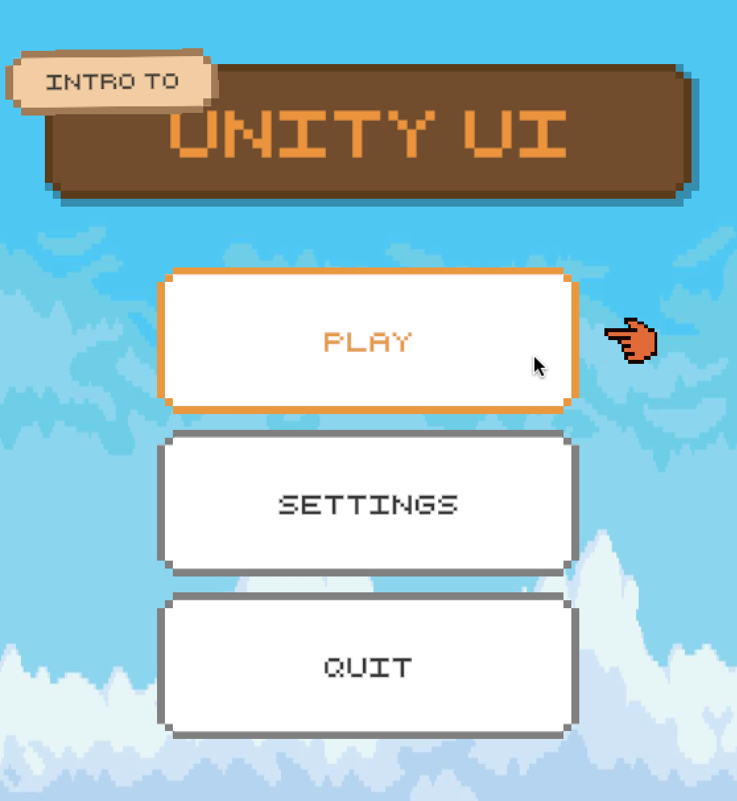
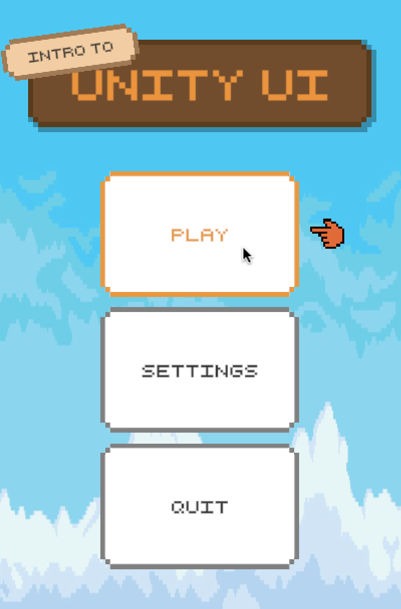

# Steer - Tech UI Skills Assessment

This Unity project replicates the menu design from the Steer Elite 2025 Tech UI Track assessment using the Unity UI framework.

## 🔗 Links

- **GitHub Repository:** https://github.com/besmelh/steer-tech-ui

## ✅ Features

- **Idle Animations**

  - "Intro To" text has a rocking motion.
  - Pointer icon has a bounce animation when visible.

- **Hover Interactions**

  - Buttons show a pointer when hovered.
  - Text and outline colors change on hover/touch.

- **Responsive Layout**
  - Layout adapts to various screen sizes and orientations.

## 🛠 Tech

- Unity 2022.3.23f1

## 📸 Screenshots

- 1700x850
  

- 1690x1200
  

- 1100x1200
  

- 800x1200
  
